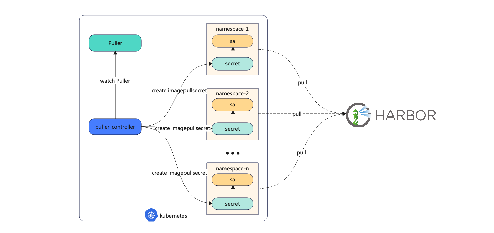

# Puller
Puller is a controller that helps kubernetes pull private images

## Architecture



## Quick Start

### Installation

#### Quick installation with all-in-one

```shell
kubectl apply -f https://raw.githubusercontent.com/Fish-pro/puller/main/deploy/all-in-one.yaml
```

We can see that `puller` is installed in the puller namespace

```
[root@york-master ~]# kubectl -n puller get po
NAME                      READY   STATUS    RESTARTS   AGE
puller-6b688c585b-5cbfq   1/1     Running   0          20s
```

#### Quick installation with Helm

```shell
git clone https://github.com/Fish-pro/puller.git
cd puller
helm install puller ./charts/puller -n puller --create-namespace
```

We can see that `puller` is installed in the puller namespace

```
[root@york-master ~]# kubectl -n puller get po
NAME                      READY   STATUS    RESTARTS   AGE
puller-68bcf6c4db-r2nwg   1/1     Running   0          27s
```

### Create an application

```shell
kubectl create -f - <<EOF
apiVersion: apps/v1
kind: Deployment
metadata:
  name: busybox
spec:
  replicas: 2
  selector:
    matchLabels:
      app: busybox
  template:
    metadata:
      labels:
        app: busybox
    spec:
      containers:
        - name: busybox
          image: release.daocloud.io/test/busybox:latest
          imagePullPolicy: Always
          command:
            - sleep
            - "10000"
          ports:
            - name: http
              containerPort: 80
              protocol: TCP
EOF
```

Failed to pull a private image after the application was created.

```shell
[root@york-master ~]# kubectl get po
NAME                       READY   STATUS         RESTARTS   AGE
busybox-6799b4f59d-kqjp8   0/1     ErrImagePull   0          34s
busybox-6799b4f59d-m562f   0/1     ErrImagePull   0          34s
```

### Create a puller

```shell
kubectl create -f - << EOF
apiVersion: "puller.io/v1alpha1"
kind: "Puller"
metadata:
  name: puller-sample
spec:
  registries:
    - server: "https://release.daocloud.io" # Replace with docker server
      username: "<docker-username>" # Replace with docker username
      password: "<docker-password>" # Replace with docker password
EOF
```

After creating the puller, restart the application and find that we can pull private images

```shell
[root@york-master ~]# kubectl rollout restart deployment/busybox
deployment.apps/busybox restarted
[root@york-master ~]# kubectl get po
NAME                       READY   STATUS    RESTARTS   AGE
busybox-76b8f599f5-4n8ls   1/1     Running   0          13s
busybox-76b8f599f5-6tf79   1/1     Running   0          11s
```

## Local build image

Clone the repo locally and execute

```shell
make images GOOS="linux"
```

## What's Next

More will be coming Soon. Welcome to [open an issue](https://github.com/Fish-pro/puller/issues)
and [propose a PR](https://github.com/Fish-pro/puller/pulls). 🎉🎉🎉

## Contributors

<a href="https://github.com/Fish-pro/puller/graphs/contributors">
  
</a>

Made with [contrib.rocks](https://contrib.rocks).

## License

Puller is under the Apache 2.0 license. See the [LICENSE](LICENSE) file for details.
